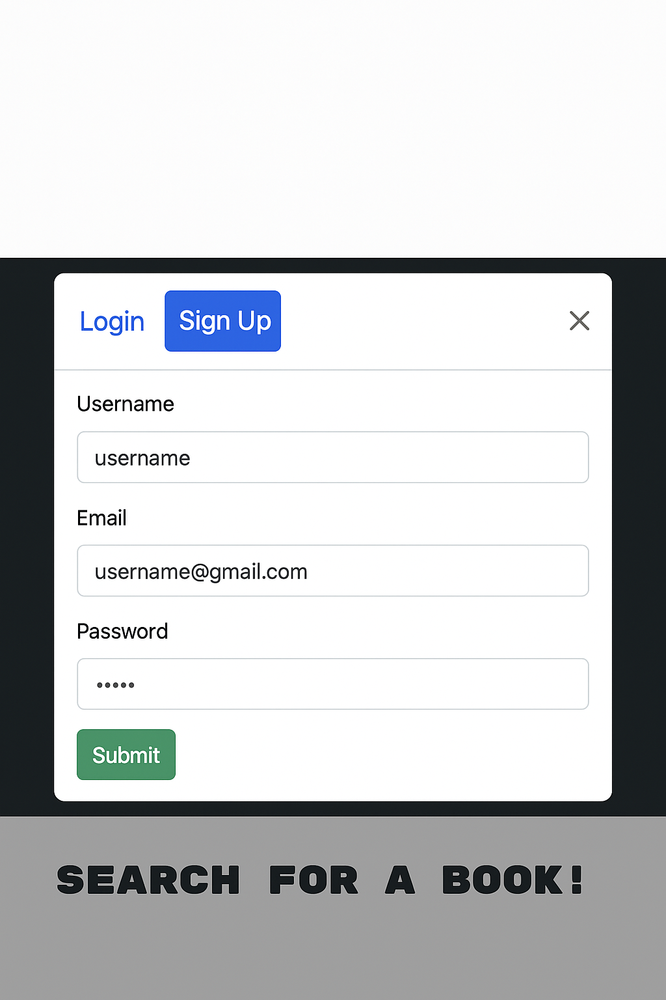
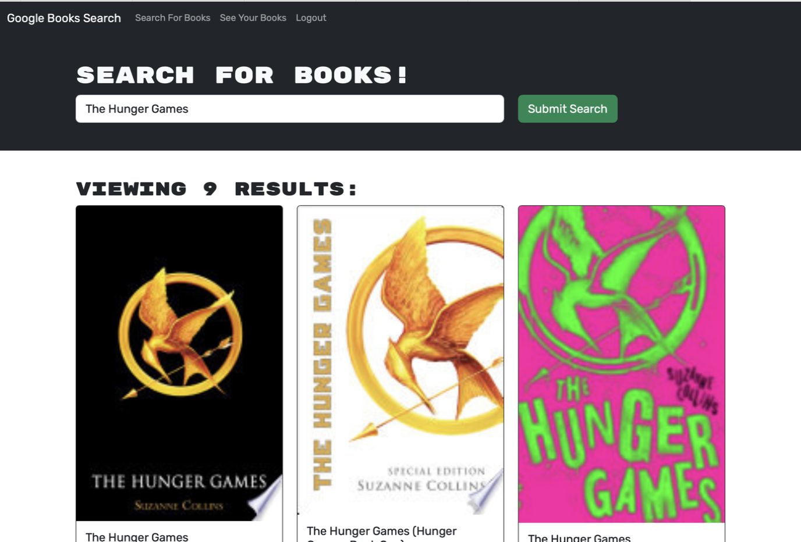
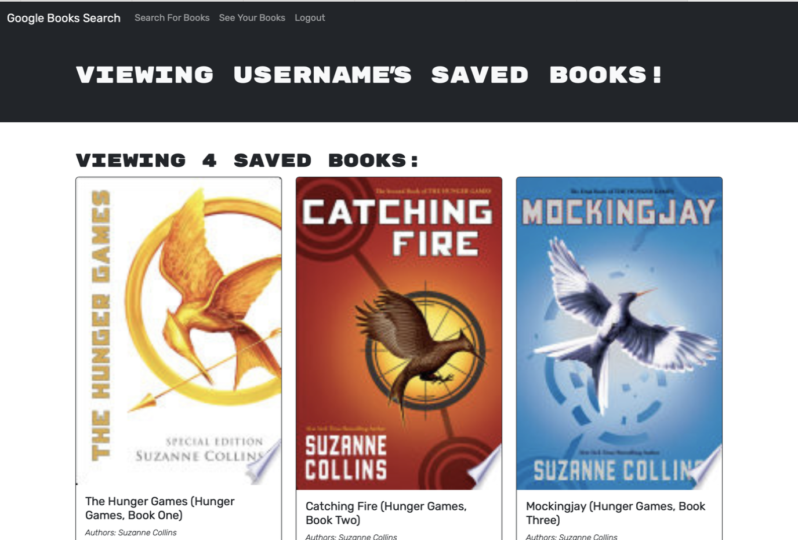

# Book Search Engine

## Description

This project is a full-stack MERN (MongoDB, Express, React, Node) application that allows users to search for books using the Google Books API and save them to their profile. It was built to further the understanding  of utilizing GraphQL, Apollo Server, JWT authentication, and deploying full-stack applications using Render. The goal is to provide a seamless experience for users to find and manage a personal reading list.

Link to application: https://booksearchengine-client.onrender.com

## Table of Contents

- [Installation](#installation)
- [Usage](#usage)
- [Features](#features)
- [Credits](#credits)
- [License](#license)

## Installation

1. Clone the repository.
2. Install dependencies in both `/client` and `/server`:
   ```
   cd client
   npm install
   cd ../server
   npm install
   ```
3. Set up environment variables:
   - In `/server/.env`:
     ```
     JWT_SECRET_KEY=your_secret
     MONGODB_URI=your_mongodb_connection_string
     ```
   - In `/client/.env`:
     ```
     VITE_API_URL=https://your-server-url/graphql
     ```
4. Run the development server:
   ```
   cd server
   npm run dev
   ```

## Usage

Users can:
- Search for books via Google Books API
- View results and detailed info
- Log in or sign up
- Save books to a personal profile
- View or delete saved books







## Features

- Full-stack MERN app with GraphQL
- Apollo Client and Apollo Server setup
- JWT authentication
- Google Books API integration
- Render deployment (backend as Web Service, frontend as Static Site)

## Credits
- Graphql
- Apollo Server
- Google Books API
- Render
- MongoDB

## License

This project is licensed under the MIT License, 2025, Stephen Schier